Operator
=======

## Filtering Operator

- Ignoring Operators

  모든 .next event를 무시한다. 다만 종료 event는 전달한다 (.error, .complete) 시퀀스가 종료되는 시점만 알 수 있다.

  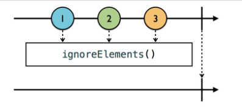

  1,2,3의 이벤트가 발생하고 있다. 하지만 모든 이벤트들이 ignoreElement()에 걸려서 통과하고 있지 못한다. 결국 subscribe하고 있는 아래 라인에서는 어떤 이벤트도 받지 못하다가 마지막 종료 이벤트만 전달되고 있음을 알 수 있다.

  ~~~swift
  let strikes = PublishSubject<String>()
  let disposeBag = DisposeBag()
  
  strikes.ignoreElements().subscribe({ (_) in
  	print("You're out!")    
  }).disposed(by:disposeBag)
  
  strikes.onNext("X")
  strikes.onNext("X")
  strikes.onNext("X")
  strikes.onCompleted()
  
  /*
  결과
  you're out!
  //종료 이벤트 1번만 전달 됨.
  */
  ~~~

 

- Element At

  "Observable에서 발생하는 이벤트 중 n번째 이벤트만 받고 싶다."  이럴 경우에 사용한다.

  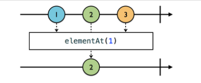

  1,2,3의 이벤트가 발생하지만 모든 이벤트를 subscribe하고 싶지가 않다. 1인덱스에 발생하는 이벤트만 subscribe하고 싶다 -> elementAt(1)

  ~~~swift
  let strikes = PublishSubject<String>()
  let disposeBag = DisposeBag()
  
  strikes.elementAt(2)
  .subscribe(onNext:{ _ in
      print("You're out!")
  }).disposed(by:disposeBag)
  
  strikes.onNext("Z")
  strikes.onNext("X")
  strikes.onNext("Y")
  
  /*
  You're out! //"Y"(2번쨰 인덱스)의 이벤트 전달 
  */
  ~~~

 

- Filter

  filter는 Bool을 리턴하는 클로저를 받아서 모든 Observable Event를 검사한다. 클로져를 true로 만족시키는 event만 filter를 통과하게 된다. 

  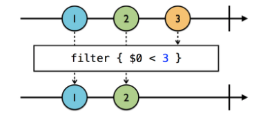

  1,2,3의 이벤트가 발생하고 있지만 이 시퀀스에 { $0 < 3 } 이라는 필터를 걸었다. 그래서 1,2의 이벤트만 전달되었다.

  ~~~swift
  example(of:"filter") {
  	let disposeBag  = DisposeBag()
      Observable.of(1,2,3,4,5,6)
      .filter{ integer in
          integer % 2 == 0
  	}.subscribe(onNext:{
          print($0)
      }).disposed(by:disposeBag)
  }
  
  /*
  결과 
  2
  4
  6
  */
  ~~~

 

- Skipping operators

  1. skip(_:)

     시퀀스에 skip operator가 전달되면, 처음에 발생하는 n개의 이벤트를 무시할 수 있다.

     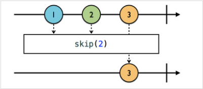

     위의 그림처럼 처음 발생한 2개의 이벤트. 즉 1,2가 무시되고 3만 전달된다.

     ~~~swift
     let disposeBag = DisposeBag()
     observable.of("A","B","C","D","E","F")
     	.skip(3)
     .subscribe(onNext:{
         print($0)
     }).disposed(by:disposeBag)
     
     /* 결과
     D
     E
     F
     */
     ~~~

      

  2. skipWhile(_:)

     skipWhile은 filter의 기능과 유사하다.

     - filter는 검사를 통과하는 element만 전달한다.
     - skipWhile은 검사를 통과하지 못한 element를 전달한다.

     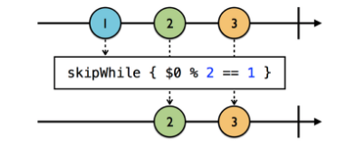

     1을 대입한 클로져는 true를 리턴한다. 1은 skip되어 전달되지 못한다.

     2을 대입한 클로져는 false를 리턴하기 때문에, skip하지 않고 전달된다.

     이후 이벤트는 클로져 검사와 관계 없이 모두 전달 된다.

     ~~~swift
     Observable.of(2,2,3,4,4)
     .skipWhile({ineger in
         integer % 2 ==0
     }
     .subscribe(onNext:{
     	print($0)               
     })
     /*결과
     3
     4
     4
     */
     ~~~

      

  3. skipUntil(_:)

     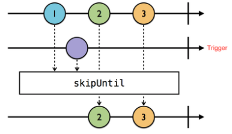

     데이터 시퀀스에서 1,2,3이 발생되고 있다.

     하지만 Trigger의  .next 이벤트(보라색 동그라미)가 발생할 때까지는 skip이 되고있다. 

     그 결과, 보라색 이벤트가 발생하기 전의 모든 이벤트가 무시된다.

     ~~~swift
     let disposeBag = DisposeBag()
     
     let subject = PublishSubject<String>()
     let trigger = PublishSubject<String>()
     
     subject
     	.skipUntil(trigger)
     	.subscribe(onNext:{
         print($0)
     })
     .disposed(by:disposeBag)
     
     subject.onNext("A")
     subject.onNext("B")
     trigger.onNext("X") //트리거의 next가 호출된 이후부터 subject에서 이벤트가 전달 된다.
     subject.onNext("C")
     
     /* 결과
     C
     */
     ~~~

   

- Taking operators

  1. take( _: )
     take은 skip의 정반대 개념이다.  skip은 처음 발생하는 n개의 이벤트를 무시하는 기능이었다면, take는 처음 발생하는 n개의 이벤트만 받고 나머지는 무시한다.

     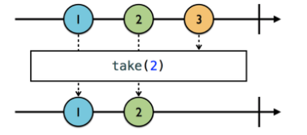

     ~~~swift
     let disposeBag = DisposeBag()
     Observable.of(1,2,3,4,5,6)
     .take(3)
     .subscribe(onNext:{
         print($0)
     })
     .disposed(by:disposeBag)
     
     /*결과
     1
     2
     3
     */
     ~~~

      

  2. takeWhile(_:)
     마찬가지로 skipWhile과 유사하다. takeWhile에는 클로져가 전달되고, 이 클로져는 이벤트의 element를 검사한다.
     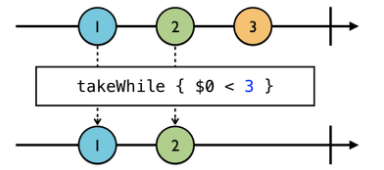

     3보다 작은 값들만 통과 시키는 클로져를 작성하였다. 1,2는 이벤트가 전달되고 클로져를 만족시키지 못하는 3이 등장한 이후부터 모든 이벤트가 무시된다.

  3. takeUntil(_:)
     skipUntil과 유사하다. 다른 트리거의 .next 이벤트가 발생되기 전까지의 이벤트를 받는다.

     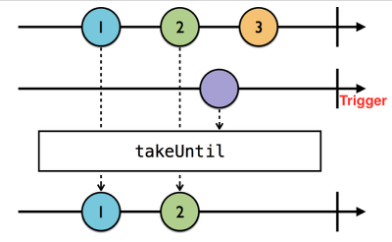

     위의 그림에서는 1,2,3의 이벤트가 발생되고 있고, takeUntil이 걸려있다. 

     1,2 이벤트 발생 후 trigger의 .next이벤트가 발생했다. 그 이후 이벤트는 모두 무시된다.

     ~~~swift
     let disposeBag = DisposeBag()
     
     let subject = PublishSubject<String>()
     let trigger = PublishSubject<String>()
     
     subject
     	.takeUntil(trigger)
     .subscribe(onNext:{
         print($0)
     }).disposed(by:disposeBag)
     
     subject.onNext("1")
     subject.onNext("2")
     trigger.onNext("X")
     subject.onNext("3")
     subject.onNext("4")
     //결과 : 1,2
     ~~~

     아래의 코드처럼 실전에서 사용한다. (dispose하는게 가장 깔끔하긴 하다.)

     ~~~swift
     someObservable
     	.takeUntil(self.rx.deallocated)
     	.subscribe(onNext:{
         print($0)
     })
     ~~~

      

- Distinct operators
  동일한 이벤트가 반복되서 발생하는 것을 막아준다.
  예를 들어 [1, 2, 2, 2, 1, 2, 1, 1] 이런 이벤트가 발생한다면 distinctUntilChanged operator를 사용했을 때 동일한 이벤트가 발생 되는 경우를 막아준다.
  위의 예시로 distinctUntilChanged를 적용하면 [1,2,1,2,1] 이벤트가 통과 될 것이다.
  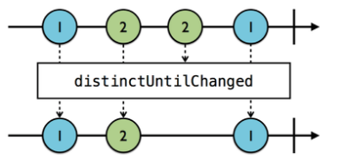
  2가 중복 되었으니 첫번쨰 1만 전달되고 무시된다.

  ~~~swift
  let disposeBag = DisposeBag()
  
  Observable.of("A","A","B","B","A")
  .distinctUntilChanged()
  .subscribe(onNext:{
      print($0)
  }).disposed(by:disposeBag)
  
  //결과 : A,B,A
  
  struct Fish{
      var name = ""
      var skinColor = ""
  }
  
  let nimo  = Fish(name:"nimo",skinColor:"red")
  let dori  = Fish(name:"dori",skinColor:"blue")
  let dori2 = Fish(name:"dori2",skinColor:"blue")
  let test = [nimo, nimo, dori, dori2, nimo]
  
  let distinctTest = Observable.from(test).distinctUntilChanged{
      $0.skinColor
  }.distinctTest.subscribe{ event in
  	print(event)
  }.disposed(by:disposeBag)
  
  /* 결과
  next((Fish #1)(name:"nimo",skinColor:"red"))
  next((Fish #1)(name:"dori",skinColor:"blue"))
  next((Fish #1)(name:"nimo",skinColor:"red"))
  completed
  */
  
  ~~~

   

- Throttle

  검색어 자동 완성을 위한 API요청을 해보자.

  a를 입력할 때 API

  p를 입력할 떄 API

  p를 입력할 떄 API

  l를 입력할 떄 API

  e를 입력할 떄 API 

  총 5번 호출하게 됨으로 상당히 안좋다.. apple이 모두 입력된 후에 한번만 호출하게 만들고 싶은데 

  이런 경우에  throttle(:_scheduler)을 사용하면 된다.

  ~~~swift
  texts.asObservable()
  	.throttle(0.5, scheduler : MainScheduler.instance)
  	.subscribe(onNext:{ [weak self] character in
      self?.requestAPI(fullText)
  }).disposed(by: bag)
  ~~~

  위의 코드는 0.5초동안 텍스트 인풋이 없으면 API호출이 되는 코드이다.

  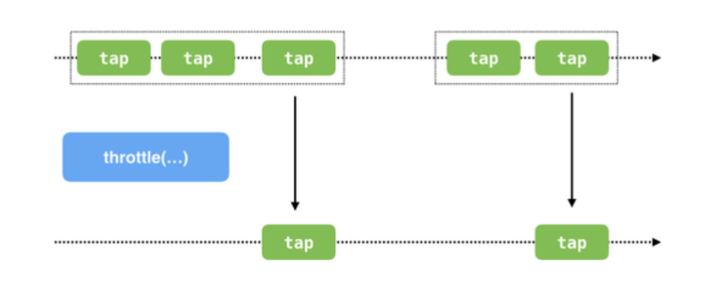

 

- Debounce

