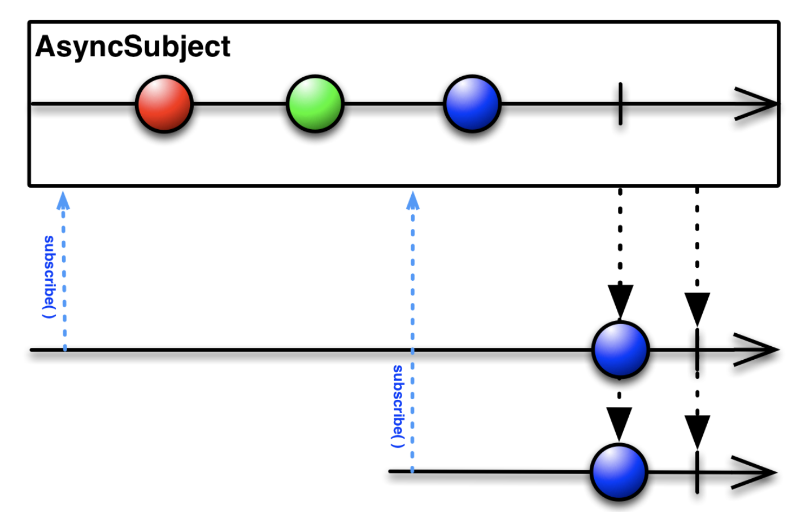
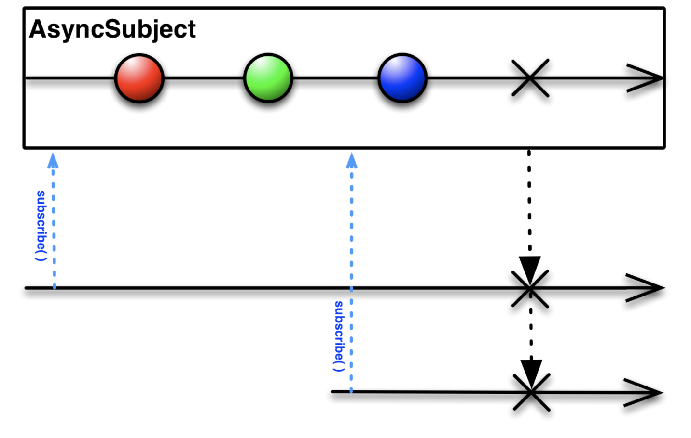
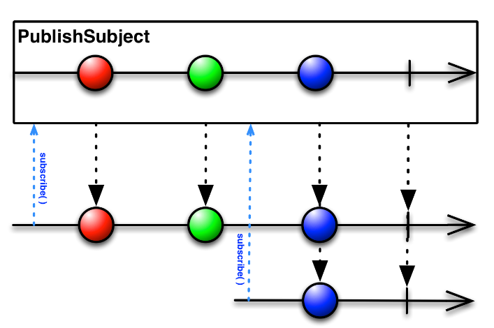
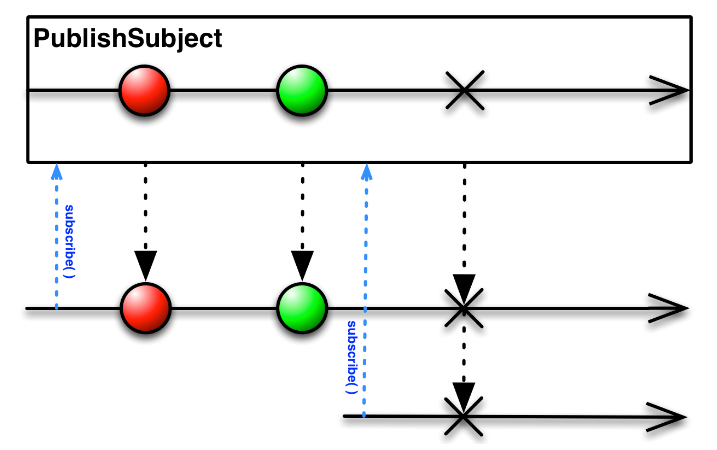
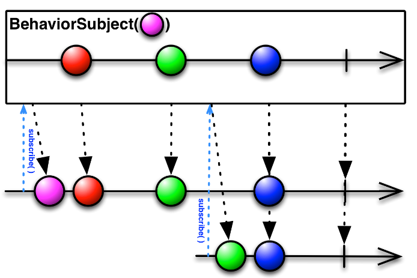
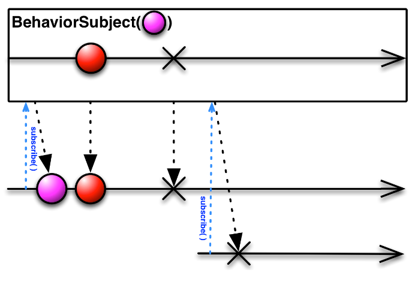
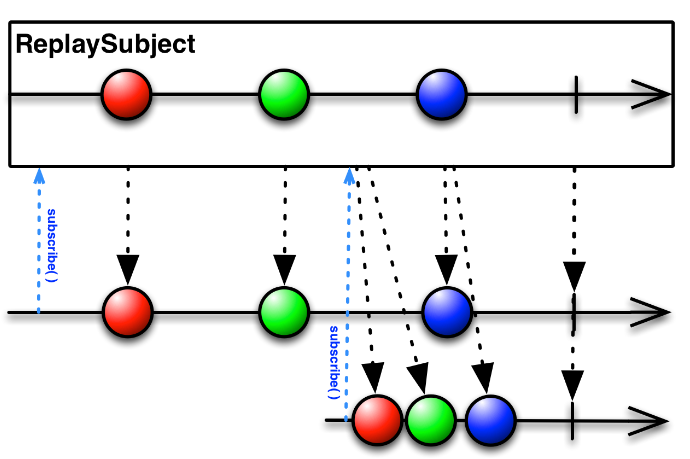

Subject
======

 

> Rx에는 Hot Observable과 Cold Observable의 개념이 있는데, Subject는 Cold Observable을 Hot하게 변형하는 효과를 얻을 수 있다.
>
> Subject는 Imperactive eventing으로 어떤 이벤트를 발생하고 싶을 때, 얼마나 많은 객체에게 그 이벤트를 구독하는지는 중요하지 않다. 원하는 이벤트를 subscription(observer) 존재 여부와 관계 없이 이벤트를 발행 할 수 있다.

 

-------------------------

 

## 4가지 종류의 subject

### AsyncSubject

complete 될때까지 이벤트는 발생되지 않으며 complete가 되면 마지막 이벤트를 발생하고 종료된다.

만약 에러로 종료되면 마지막 이벤트 전달 없이 에러가 발생된다.

~~~swift
let asyncSubject = AsyncSubject<String>()
asyncSubject.debug().subscribe{
    print($0)
}.disposed(by:disposeBag)

asyncSubject.on(.next("1"))
asyncSubject.on(.next("2"))
asyncSubject.on(.next("3"))
asyncSubject.on(.completed)

/*
결과 
//asyncSubject()->subscribed
//asyncSubject()->Event next(3)
next(3)
//asyncSubject()->Event completed
completed
//asyncSubject()->isDisposed
*/
~~~

 

### PublishSubject

PublishSubject는 subscribe 된 시점 이후부터 발생한 이벤트를 전달한다. subscribe 되기 이전의 이벤트는 전달하지 않는다.

에러가 발생하면 마찬가지로 에러를 전달한다.

~~~swift
let publishSubject = PublishSubject<String>()
publishSubject.debug().subscribe{
    print("first subscribe:\($0)")
}.disposed(by:disposeBag)

publishSubject.on(.next("1"))
publishSubject.on(.next("2"))
publishSubject.debug().subscribe{
    print("second subscribe:\($0)")
}.disposed(by:disposeBag)
publishSubject.on(.next("3"))
publishSubject.on(.completed)

/** 
결과
//publishSubject()->subsribed
//publishSubject()->Event next(1)
first subscribe: next(1)
//publishSubject()->Event next(2)
first subscribe: next(2)
//publishSubject()->subscribed
//publishSubject()->Event next(3)
first subscribe: next(3)
second subscribe: next(3)
//publishSubject()->Event completed
first subscribe: completed
//publishSubject()->isDisposed
//publishSubject()->Event completed
second subscribe: completed
//publishSubject()->isDisposed
*/
~~~

 

### BehaviorSubject

기본적으로는 publish와 유사하지만 초기 값을 가진 subject이다. subscribe가 발생하면 즉시 현재 저장된 값을 이벤트로 전달한다. 마지막 이벤트 값을 저장하고 싶을 때 사용한다.

에러 발생 시

~~~swift
let behaviorSubject = BehaviorSubject<String>(value:"tom")
behaviorSubject.debug("behavior subject log 1").subscribe{
    print($0)
}.disposed(by:disposeBag)
behaviorSubject.on(.next("jack"))
behaviorSubject.on(.next("wade"))
behaviorSubject.debug("behavior subject log2 :").subscribe{
    print($0)
}.disposed(by:disposeBag)

/*
결과
behavior subject log 1: -> subscribed
behavior subject log 1: -> Event next(tom)
next(tom)
behavior subject log 1: -> Event next(jack)
next(jack)
behavior subject log 1: -> Event next(wade)
next(wade)
behavior subject log 2: -> subscribed
behavior subject log 2: -> Event next(wade)
next(wade)
*/
~~~

첫번째 subscribe 직후 최초 생성 시 설정한 값인 tom이 이벤트로 전달됐다. 이후 jack wade가 전달되었으며, 이후 두번째 subscribe 되자, 마지막 값인 wade가 이벤트로 전달되었다.

 

포인트는 마지막 이벤트의 값이 저장된다는 것이다. 마지막 값이 중요하거나, 최초 subscribe시 이벤트가 바로 전달되어야 할 때 사용하면 좋다.

 

### ReplaySubject

n개의 이벤트를 저장하고 subscribe가 되는 시점과 상관없이 저장된 모든 이벤트를 전달한다.  

RxSwift에서는 아래와 같이 2개의 생성함수가 있다.

~~~swift
static func create(bufferSize:Int)->ReplaySubject<Element>
static func createUnbounded()->ReplaySubject<Element>
~~~

createUnbounded는 subject의 생성 이후 발생하는 모든 이벤트를 저장한다.

~~~swift
let replaySubject = ReplaySubject<String>.create(bufferSize:2)
replaySubject.on(.next("tom"))
replaySubject.on(.next("jack"))
replaySubject.on(.next("wade"))
replaySubject.debug("replay subject log: ").subscribe{
    print($0)
}.disposed(by:disposeBag)
/*
replay subject log: -> subscribed
replay subject log: -> Event next(jack)
next(jack)
replay subject log: -> Event next(wade)
next(wade)
*/
~~~

이벤트는 3번 발생했지만, create(bufferSize:2) 버퍼 사이즈가 2라서 마지막 2개의 이벤트만 전달되었다.
let replaySubject = ReplaySubject<String>.createUnbounded()
로 생성헀다면 모든 이벤트가 전달 되었을 것이다.

